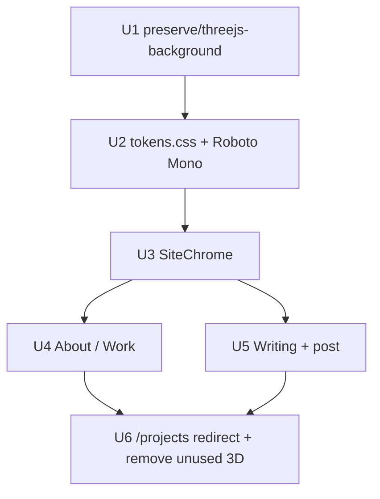

# Night Ledger redesign - Plan

## Goal Capsule

- Objective: The public site reads as Night Ledger — name, work, writing — with no decorative chrome.
- Means: Restyle the existing Next.js app against `DESIGN.md` and `tokens.css` (KTD2). Snapshot the current Three.js site onto `preserve/threejs-background` first (KTD1).
- Authority: `DESIGN.md` > Paper Night Ledger system page > this plan > current `app/` styles.
- Stop: About, Writing, and a post match the Paper canonical screens. Old Three.js look is still checkout-able on its preserve branch.
- Execution profile: code, one redesign branch.
- Tail: leave the preserve branch unmerged; ship Night Ledger from the redesign branch.

## Product Contract

### Summary

Replace the Geist + Liquid Ether / crystalline site with the locked Night Ledger system: dark paper, Roboto Mono, 720px measure, text-only nav and footer. Keep Stephen's real copy, projects, and posts.

### Problem Frame

The live site is a different product than the design Stephen picked. Night Ledger is dark, mono, and typographic. The live site is light/dark Geist with a WebGL background, icon footer, command palette, and a separate projects search page. Implementing without a freeze branch would make the old look hard to restore.

### Key Decisions

- Night Ledger is the production direction, not Dossier, Letter, or Sepia. (session-settled: user-directed — chosen over the other three Paper prototypes: "I think I like the Night Ledger the best") Governs R1, R2.
- No structural borders, corner marks, or the amber top bar. (session-settled: user-directed — chosen over the framed dossier chrome: user pointed at the half-square marks and top bar) Governs R3.
- Keep the Three.js site on its own branch so it can be restored. (session-settled: user-directed — chosen over deleting the old look in place) Governs R10.

### Requirements

**Look**

- R1. The site uses Night Ledger tokens from `tokens.css`: paper `#282828`, ink `#ebdbb2`, accent `#d79921`, Roboto Mono 400/700.
- R2. Content sits in a centered 720px column. The viewport is flat paper. No WebGL, grain, or gradient canvas.
- R3. No 1px rules, cards, corner registration marks, or a top accent bar. Hierarchy is type, color, and space.
- R4. One dark theme. No light/dark toggle in this system.

**Chrome**

- R5. Header is the site name on the left and About / Writing on the right. The current route is accent. Title case. No coded labels.
- R6. Footer is text links GitHub, LinkedIn, X. No icons.

**Pages**

- R7. About (`/`) is the home page: short bio, then a Work list of real projects from `lib/site-data.ts` (name + one-line description).
- R8. Writing (`/writing`) is a dated index of posts. A post (`/writing/[slug]`) is date, title, then sentence-case body.
- R9. `/projects` does not remain a third primary destination. Search-and-cards is out of this system.

**Rollback**

- R10. Before any `app/` visual change, the current Three.js site (Liquid Ether / crystalline, Geist, theme toggle, icon footer, command palette, projects search) exists on a long-lived branch named `preserve/threejs-background`.

### Success Criteria

- A visitor can tell they are on Stephen's site, see his work, and read a post without decorative chrome competing.
- Checking out `preserve/threejs-background` restores the previous look.

### Scope Boundaries

In scope: visual system, chrome, About, Writing, post, routing for `/projects`, freeze of the old look.

Deferred for later: new writing posts, project case studies, images on About.

Outside this product's identity: marketing CTAs, a second typeface, light mode, decorative 3D.

### Actors

- A1. Visitor reading the portfolio.
- A2. Stephen restoring the old look from git.

### Key Flows

- F1. Visit home. See name, About current, bio, Work, footer words.
- F2. Open Writing, then a post. Read longform in sentence case.
- F3. Restore the old site by checking out `preserve/threejs-background`.

### Acceptance Examples

- AE1. Covers R3, R5. Given the home page, when the visitor looks at the header, then there is no line under it and About is amber.
- AE2. Covers R6. Given the footer, when the visitor tabs through it, then they hear or see the words GitHub, LinkedIn, X, not icon-only controls.
- AE3. Covers R10. Given the preserve branch, when it is checked out, then `LiquidEtherBackground` (or crystalline) still mounts from `app/layout.tsx`.

---

## Planning Contract

### Key Technical Decisions

- KTD1. Freeze first. Create `preserve/threejs-background` from the last commit that still has the Three.js site, before editing `app/`, `components/`, or `globals.css`. (session-settled: user-directed — chosen over rewriting in place: restore path must exist) Instantiates R10.
- KTD2. `DESIGN.md` and `tokens.css` are the system. Import `tokens.css` into the app entry stylesheet. Do not keep a parallel palette in `globals.css`. Paper canonical screens live at the Night Ledger system page. Instantiates R1.
- KTD3. Dark only. Remove the theme script, `.dark` variants for this look, and the sun/moon control. Favicon can stay on the dark set. Instantiates R4.
- KTD4. Put work on About. Redirect `/projects` to `/`. Leave `lib/site-data.ts` as the project source. Instantiates R7, R9.
- KTD5. Drop command palette and Lucide from chrome. Footer and nav are text. Instantiates R5, R6.
- KTD6. Load Roboto Mono through the existing Next font path (or `next/font/google`). Replace Geist as the document face. Instantiates R1.

### High-Level Technical Design

Visual source: Paper [Night Ledger system](https://app.paper.design/file/01M0G23BZ7JQY2RACP0945SX4B/3-0) artboards Foundations, Components, About, Writing, Post.

Code source today: `app/layout.tsx` mounts `LiquidEtherBackground` and `SiteChrome`. `components/site-chrome.tsx` owns nav, theme, palette, icon footer. `app/page.tsx` is the current About. `app/writing/` is the writing surfaces. `lib/site-data.ts` and `lib/writing.ts` stay.

### Assumptions

- Production rollback is git, not a runtime flag.
- Existing MDX posts keep their content; only presentation changes.
- `docs/brand-guidelines.md` stays as history and is not implemented.

### Implementation constraints

- Do not rewrite `lib/site-data.ts` project facts.
- Do not delete Three.js files until they exist on the preserve branch.
- Match Paper screens; do not reintroduce dossier borders.

---

## Implementation Units

### U1. Freeze the Three.js site

- Goal: The old look is a checkout away.
- Requirements: R10
- Dependencies: none
- Files: git branch only; no app edits
- Approach:
  1. Create `preserve/threejs-background` from the current commit that still includes `components/liquid-ether-background.tsx`, `lib/crystalline-background/`, Geist, theme toggle, and `/projects`.
  2. Leave that branch unpublished-or-published as Stephen prefers; do not merge it into the redesign.
- Test expectation: none -- branch snapshot, not behavior.
- Verification: On that branch, `app/layout.tsx` still mounts the WebGL background.

### U2. Adopt Night Ledger tokens and type

- Goal: The document face and colors are the locked system.
- Requirements: R1, R2
- Dependencies: U1
- Files: `app/layout.tsx`, `app/globals.css`, `tokens.css`, `package.json` if a font package is added
- Approach:
  1. Import `tokens.css` from `app/globals.css` after the Tailwind import.
  2. Set `html` / `.site-canvas` to `var(--color-paper)` and `var(--color-ink)`.
  3. Load Roboto Mono 400/700. Remove Geist as the body face.
  4. Stop mounting `LiquidEtherBackground` (or crystalline) on this branch.
  5. Constrain `.site-column` to `--container-page` (720px), centered, no decorative background.
- Patterns to follow: existing `@import "tailwindcss"` in `app/globals.css`; token names in `DESIGN.md`.
- Test scenarios:
  - Happy path: home HTML computed background is `#282828` and the body font includes Roboto Mono.
  - Regression: no `<canvas>` from liquid-ether or crystalline on `/`.
- Verification: Browser on `/`. Paper About vs the live column. Mobile 375 and desktop 1280.
- Execution note: This is styling; prefer browser verification over unit tests.

### U3. Replace site chrome

- Goal: Header and footer match Night Ledger. No icons, palette, or theme switch.
- Requirements: R3, R4, R5, R6
- Dependencies: U2
- Files: `components/site-chrome.tsx`, `app/layout.tsx`, `lib/favicon.ts` if the toggle path dies
- Approach:
  1. Name left, About / Writing right. Current route uses `--color-accent`.
  2. Footer: GitHub, LinkedIn, X as text using `site.social`.
  3. Remove command palette, theme button, and Lucide usage from chrome.
  4. Remove the pre-paint theme script from `app/layout.tsx`. Pin the dark favicon set.
  5. `:focus-visible` 2px solid `--color-focus`, 2px offset.
  6. No `border-t` on header or footer.
- Patterns to follow: Paper Components artboard; links already in `lib/site-data.ts`.
- Test scenarios:
  - Covers AE1. Header has no bottom rule; About is accent on `/`.
  - Covers AE2. Footer exposes three text links, not icon-only buttons.
  - Keyboard: tab to Writing shows the focus outline.
- Verification: `/` and `/writing` chrome match Paper.

### U4. About is home + work

- Goal: `/` is the Night Ledger About screen.
- Requirements: R7
- Dependencies: U3
- Files: `app/page.tsx`
- Approach:
  1. Replace diamond rows, logos, and signature with bio + Work list.
  2. Map `projects` from `lib/site-data.ts` to stacked name + description rows.
  3. Name may link to `githubUrl` or `demoUrl`. No screenshots in this unit.
- Patterns to follow: Paper About artboard; current `projects` array.
- Test scenarios:
  - Happy path: Cowboy Cards, Books4Sale, Drake Lyrics Generator all render with their descriptions.
  - Empty: if `projects` were empty, Work heading still renders and the page does not crash.
- Verification: Side-by-side with Paper About.

### U5. Writing index and post

- Goal: Reading matches the Paper Writing and Post screens.
- Requirements: R8
- Dependencies: U3
- Files: `app/writing/page.tsx`, `app/writing/[slug]/page.tsx`, `app/globals.css` (prose)
- Approach:
  1. Index: date, title, optional description excerpt. Stacked. No dashed empty-state card chrome — empty state can be a sentence.
  2. Post: date in accent, title 22px, body 15/26 sentence case. Restyle `.prose` to Night Ledger tokens. No italic headers.
- Patterns to follow: Paper Writing and Post; `lib/writing.ts` unchanged.
- Test scenarios:
  - Happy path: `/writing` lists `learning-to-code-in-the-agentic-era`.
  - Happy path: `/writing/learning-to-code-in-the-agentic-era` shows the title and body in Roboto Mono on paper.
  - Unknown slug: still 404.
- Verification: Read the real post end to end. Compare to Paper Post.

### U6. Retire projects search from this look

- Goal: Night Ledger has two destinations: About and Writing.
- Requirements: R9
- Dependencies: U4, U5
- Files: `app/projects/page.tsx` or `next.config.ts`, `components/project-search.tsx` (leave file, stop linking)
- Approach:
  1. Permanent redirect `/projects` to `/`.
  2. Remove Projects from nav (already gone in U3).
  3. Do not delete `project-search.tsx` on this pass; it remains on the preserve branch and as unused code until a later cleanup.
- Test scenarios:
  - `/projects` redirects to `/`.
  - Nav has no Projects link.
- Verification: Visit `/projects` in the browser.

---

## Verification Contract

| Gate | Command / action | Applies |
| --- | --- | --- |
| Lint | `npm run lint` | After U2–U6 |
| Build | `npm run build` | After U6 |
| Browser | Open `/`, `/writing`, a post, `/projects` | After U3–U6 |
| Visual | Paper About / Writing / Post vs live | After U4, U5 |
| Rollback | Checkout `preserve/threejs-background` and confirm WebGL chrome | After U1 |

No dedicated unit-test runner in `package.json`. Treat lint, build, and browser as the gates.

## Definition of Done

- U1–U6 complete.
- `DESIGN.md` and Paper Night Ledger system still match the live pages.
- `preserve/threejs-background` still has the Three.js site.
- Abandoned experiments from this redesign are not left in `app/`.
- `npm run lint` and `npm run build` pass.

## Sources

- Paper: [Night Ledger system](https://app.paper.design/file/01M0G23BZ7JQY2RACP0945SX4B/3-0)
- `DESIGN.md`, `tokens.css`
- Live structure: `app/layout.tsx`, `components/site-chrome.tsx`, `app/page.tsx`, `app/writing/`
